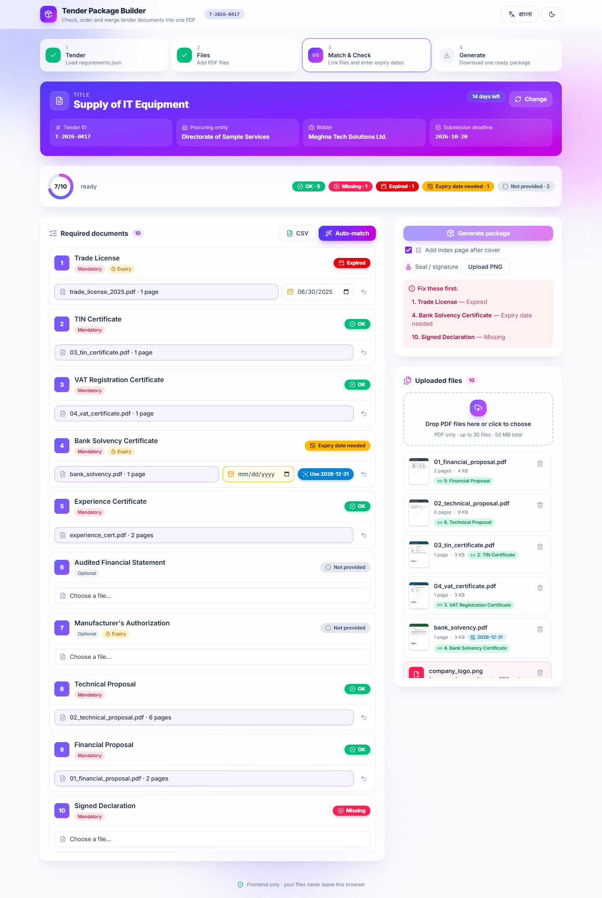
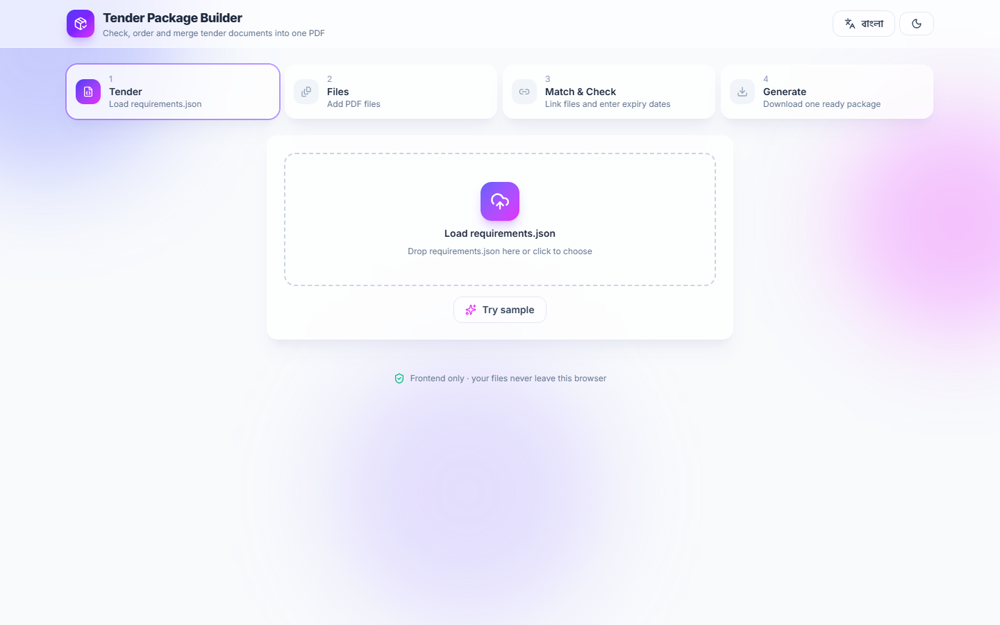
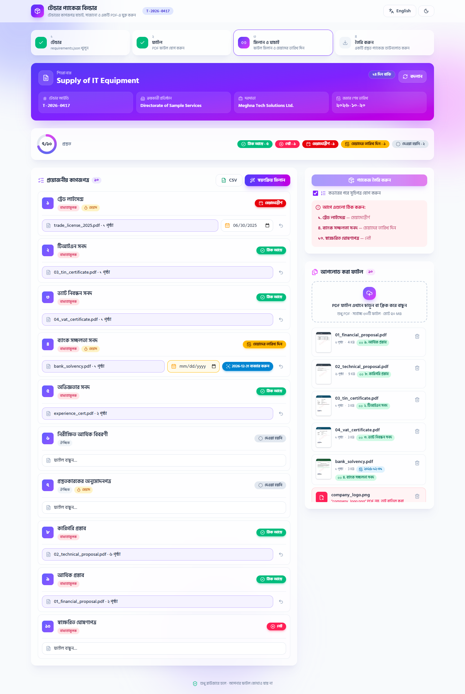
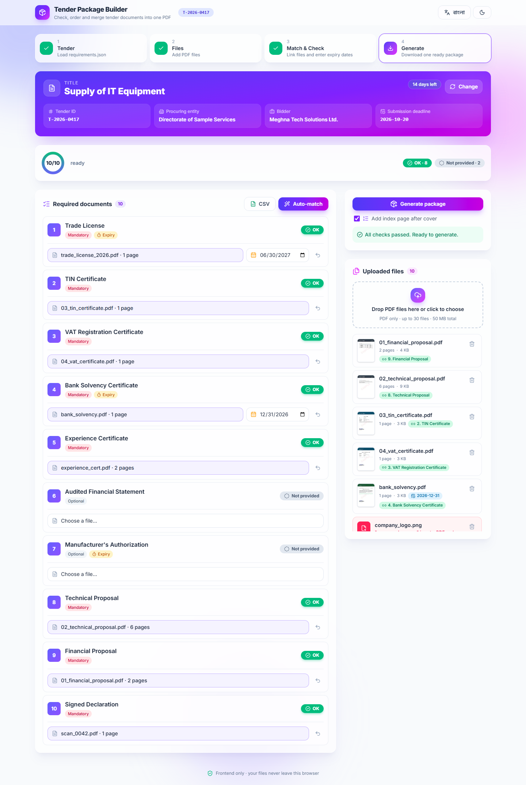
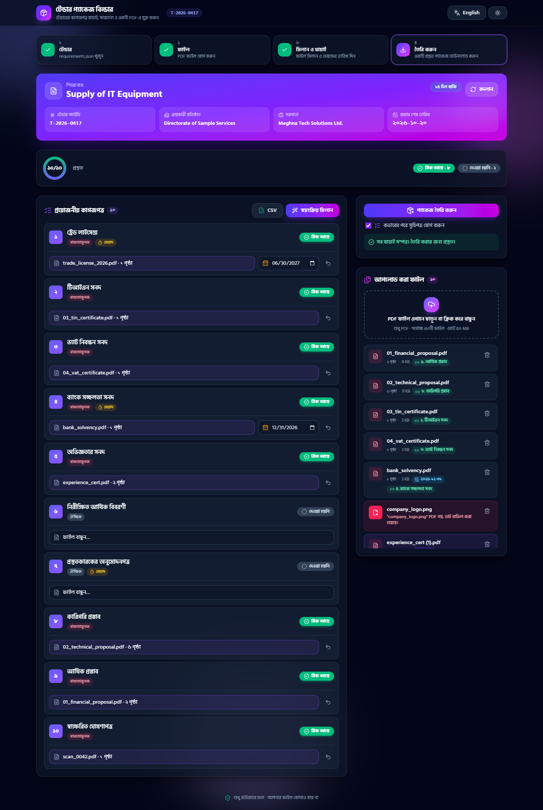

# Tender Document Package Builder · টেন্ডার প্যাকেজ বিল্ডার

A frontend-only web app that helps office staff turn a set of PDF files into **one complete, checked and correctly ordered tender package PDF**. Works fully in Bangla and English.

| | |
|---|---|
| **Name** | Md Abdul Quym Shanto |
| **Registration Number** | VC027 |
| **Live link (HTTPS)** | https://devfest-vc-027.vercel.app/ |
| **Repository** | https://github.com/aqshanto/devfest-VC027 |
| **License** | MIT (see [LICENSE](LICENSE)) |



## How to run

Live: open **https://devfest-vc-027.vercel.app/** in Google Chrome. Nothing to install, no login.

Locally (Node 18+):

```bash
npm install
npm run dev        # http://localhost:5173
npm run build      # production build in dist/
npm run preview    # serve the build
npm test           # unit tests (status rules, duplicate guard, JSON parsing)
```

How to use:
1. **Tender:** load `requirements.json` (or click **Try sample**).
2. **Files:** drop/upload PDF files (many at once).
3. **Match & Check:** choose a file for each required document, enter expiry dates where asked. Statuses update instantly.
4. **Generate:** when nothing is blocking, click **Generate package**, then **Preview** or **Download** `<tender_id>_Package.pdf`.

Handy URL parameters: `?lang=bn|en`, `?theme=dark|light`, `?sample=1` (auto-load the sample pack), `&demo=problems|ready` (pre-filled matches used for screenshots).

## Main features (all done)

- **4.1 Load the list:** reads `requirements.json`, validates it, shows the tender details and the required documents sorted by `order`.
- **4.2 Upload files:** upload many PDFs at once (drag and drop or picker). Shows file name, page count (pdf.js) and size. A non-PDF is rejected with a clear message (both the extension and the `%PDF` header are checked). Any file can be removed. Limits: 30 files and 50 MB total.
- **4.3 Match files:** a dropdown per document. One file → one document, one document → one file. Change or undo (↺) at any time.
- **4.4 Expiry dates:** a date field appears when `has_expiry = true` and a file is matched. Changing the file clears the old date.
- **4.5 Check everything:** live status per document: **Missing**, **Expiry date needed**, **Expired**, **Not provided**, **OK**. Same day as the deadline counts as OK. There is a summary ring plus counts.
- **4.6 Duplicates:** SHA-256 of the file content finds identical files even with different names. They get a **Duplicate** badge and cannot be matched to different documents.
- **4.7 Make the package:** the Generate button stays disabled while any document is blocking. The reasons are listed, and clicking one scrolls to that document. The PDF has:
  - an English cover page with tender ID, title, procuring entity, bidder, deadline, generation date, and the included documents in order;
  - every page of each document after the cover, sorted by `order`, with optional documents that have no file skipped;
  - the footer `<tender_id> | Page X of Y` on every page, including the cover. Each page is scaled into a reserved bottom band, so the footer never covers content.
- **4.8 Download:** after **Generate package**, the user chooses **Preview** (an in-app PDF viewer, closed with Esc) or **Download**. The file is named `<tender_id>_Package.pdf`.
- **4.9 Two languages:** a one-click EN/বাংলা toggle that is remembered in `localStorage`. Every label, button, status, error and instruction is translated, and numbers show as Bangla digits. Document names come from `title_bn` or `title_en`.
- Output: [`output/T-2026-0417_Package.pdf`](output/T-2026-0417_Package.pdf) is built from the sample pack after resolving its problems (17 pages: cover, index with Bangla names, and 15 document pages). It was generated through the app with `scripts/output-from-browser.mjs`.
- Polished UI: gradient and glass design, dark mode, 4-step stepper, toasts, mobile layout.

### Problems found in the sample pack
- `trade_license_2025.pdf` expired on 2025-06-30, so it shows **Expired**. Use `trade_license_2026.pdf` (valid to 2027-06-30).
- `experience_cert.pdf` and `experience_cert (1).pdf` have identical content, so they are marked **Duplicate**.
- `company_logo.png` is not a PDF, so it is rejected.
- `scan_0042.pdf` is the scanned **Signed Declaration**.
- The file numbers are misleading: `01_financial_proposal` goes at order 9 and `02_technical_proposal` at order 8.
- The optional Audited Financial Statement and Manufacturer's Authorization are not in the pack, so they show **Not provided**.

## Bonus features

- **🔍 Smart Read (PDF text):** pdf.js reads the text of the first pages of every PDF, all inside the browser.
  - **Document detection by content:** it recognises the document even when the file name means nothing (tested with the sample files renamed to `file_0.pdf` and so on). The best guess appears as a chip in the file list.
  - **Expiry date detection:** it finds dates after "Valid until / Expiry / Validity" in formats such as `2027-06-30`, `30 June 2027`, `June 30, 2027` and `30/06/2027`. The date shows as a chip on the file (red if it is before the deadline). On a manual match, a one-click **Use <date>** button appears. Dates filled by Auto-match get a "Read from PDF" badge so the user can check them. Without user action, the status still follows Section 5 (a manual match shows *Expiry date needed* until a date is set).
  - When two files fit the same document, Auto-match prefers the one that is still valid (so `trade_license_2026` wins over the expired 2025 one).
- **✨ Auto-match:** one click suggests matches from the file names. It uses keywords and synonyms from `title_en` (trade/licence, tin/tax, vat/bin, solvency/bank and so on), prefers the newer year (`_2026` over `_2025`) and the original over a `(1)` copy, never uses two duplicates, and fills only documents that are still empty. An **Undo** button restores the previous matches.
- **Bangla text on the PDF:** the index page shows each document's Bangla name (`title_bn`) under the English one and a "সূচিপত্র" heading. Bangla in tender fields (title, entity, bidder) also prints correctly on the cover. The browser draws the text on a canvas, so conjuncts such as ন্স, ক্ষ and ত্র are shaped correctly, and the image is embedded with pdf-lib.
- **Index page after the cover:** lists each document with its page range and the page where it starts, with dotted leaders. It is on by default and can be turned off with a checkbox. The cover table also shows the start pages.
- **Export checklist (CSV):** the CSV button downloads `<tender_id>_Checklist.csv` with Order, Document, Mandatory, File name, Pages, Expiry date and Status, in the chosen language. It has a UTF-8 BOM so Excel shows Bangla correctly.
- **Wrong-file warning:** when a file's name or text clearly belongs to another document (for example `trade_license_2025.pdf` matched to TIN Certificate), a soft amber warning appears. The status still follows Section 5 exactly.
- **Handle bad files safely:** damaged, truncated, empty, fake (`.pdf` that is not a PDF) and password-protected files each show a clear bilingual message instead of crashing. All of these were tested.
- **Page thumbnails:** every PDF in the file list shows a small picture of its first page (made in the background, so it never slows the upload). Hover to zoom. This helps with scans whose name means nothing, such as `scan_0042.pdf`.
- **Preview before download:** after generating, the package can be viewed in an in-app PDF viewer or downloaded directly.

## Known issues

- The date picker shows the browser's own date format (for example mm/dd/yyyy). It is stored as YYYY-MM-DD.
- The PDF cover page is English only (the problem asks for English); Bangla on the cover is a bonus item.
- Bangla on the PDF is drawn as small images, so that text cannot be selected or searched in the PDF. The Node script `scripts/make-output.mjs` cannot draw it (it has no canvas); `scripts/output-from-browser.mjs` builds the full version.
- Scanned PDFs have no text, so Smart Read cannot recognise them (for example `scan_0042.pdf`). Match them by hand.
- Each page is scaled to about 96% to make room for the footer, so page content is slightly smaller.
- Download-manager browser extensions (for example IDM) can intercept PDF requests and break **Try sample**. Uploading files by hand still works.

## AI tools used

- **Claude Code (Claude Opus 5.5)**: planning (`Plan.md`), code generation, testing, git commits and README. Every prompt is listed in [`Prompt.md`](Prompt.md) and in each commit message.

## Most useful prompt

> "F3 from Plan.md: user matches each file to one document and can change/undo, expiry date when has_expiry, status per Section 5 updated instantly, duplicates cannot go to different documents"

This prompt, together with a written `Plan.md` that listed the exact status rules, produced the core checking logic and its unit tests in a single step.

## Tech

Vite + React, Tailwind CSS v4, lucide-react icons, **pdf-lib** (merge, cover, footer), **pdfjs-dist** (page count, bad-file detection, Smart Read text), Web Crypto SHA-256, Vitest. Everything runs in the browser. There is no backend and no stored secrets.

## Screenshots

| | |
|---|---|
|  |  |
|  |  |

Mobile: [screenshots/06-mobile-bn.png](screenshots/06-mobile-bn.png). The screenshots are taken with `node scripts/screenshots.mjs` (headless Chrome).
